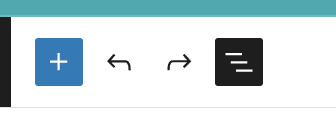
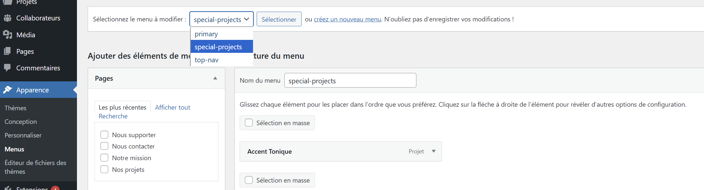
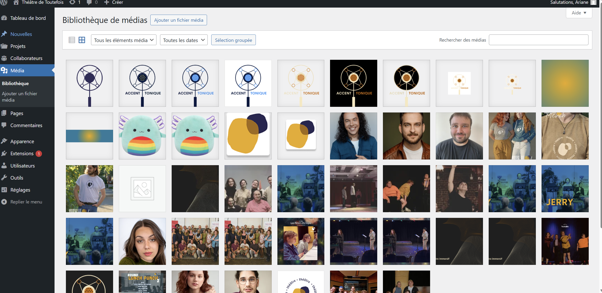

# WordPress (Backend)

## Qu'est-ce que WordPress ?

WordPress est un système de gestion de contenu (CMS) qui permet de créer et gérer facilement le contenu d'un site web sans connaissances techniques approfondies. Dans le projet Toutefois, WordPress est utilisé comme "backend" - c'est là où vous créez et gérez tout le contenu.

## Accès à l'administration WordPress

1. Pour accéder au panneau d'administration WordPress :

   - Allez à : `https://admin.toutefois.ca/wp-admin`
   - Connectez-vous avec vos identifiants

2. Une fois connecté, vous verrez le "Tableau de bord" WordPress où vous pourrez gérer tout le contenu du site.

## Structure des dossiers WordPress

```
wp-content/
├── plugins/
│   ├── toutefois/ - Plugin personnalisé pour le site
│   │   ├── components/ - Composants WordPress réutilisables
│   │   ├── build/ - Blocs Gutenberg compilés
│   │   ├── src/ - Code source des blocs Gutenberg
│   │   ├── inc/ - Fonctions PHP supplémentaires
│   │   └── *.php - Fichiers PHP principaux
│   └── autres plugins...
└── themes/
    └── api-placeholder-theme/ - Thème minimaliste (site headless)
```

## Le plugin Toutefois

Un plugin WordPress personnalisé a été développé spécifiquement pour le site Toutefois. Il comprend :

1. **Types de contenu personnalisés** :

   - Projets (`projets.php`)
   - Nouvelles (`news.php`)
   - Collaborateurs (`cpt-collaborateurs.php`)

2. **Blocs Gutenberg personnalisés** :

   - Carousel de contenu (`content-carousel`)
   - Liste de projets
   - Liste de nouvelles
   - Et autres...

3. **API REST** : Points d'accès personnalisés pour que le frontend puisse accéder aux données

## Blocs Gutenberg

Gutenberg est l'éditeur par défaut de WordPress. Il utilise des "blocs" pour créer du contenu. Le plugin Toutefois ajoute des blocs personnalisés adaptés aux besoins du site :

- **Carousel de contenu** : Affiche un carrousel rotatif de projets ou nouvelles
- **Liste de projets** : Affiche une grille ou liste de projets
- **Liste de nouvelles** : Affiche les dernières actualités
- **Collaborateurs** : Affiche l'équipe de Toutefois

Pour ajouter un bloc dans une page :

1. Cliquez sur le symbole "+" dans l'éditeur
2. Recherchez le bloc souhaité dans la catégorie "Toutefois"
3. Configurez le bloc selon vos besoins

Liens utiles WordPress:

- Éditeur de blocs (Gutenberg): https://wordpress.org/documentation/article/wordpress-block-editor/
- Vue d’ensemble de l’éditeur: https://wordpress.org/documentation/article/block-editor-screen-overview/

<SCREENSHOT> Bouton "+" et panneau d’insertion des blocs

<VIDEO> Ajouter/configurer un bloc personnalisé « Toutefois »
<video controls src="images/02-wordpress/02-ajouter-configurer-un-bloc-personnalisé-Toutefois.mp4" title="Title"></video>

## Menus WordPress

Le site utilise deux menus WordPress principaux :

- **Menu principal** (top-nav) : Navigation principale du site
- **Projets spéciaux** (special-projects) : Menu dédié aux projets spéciaux

Ces menus sont configurés dans WordPress sous `Apparence > Menus`.

Documentation WordPress:

- Menus (apparence et gestion): https://wordpress.org/documentation/article/appearance-menus-screen/

<SCREENSHOT> Écran « Apparence > Menus » avec sélection du menu

<VIDEO> Ajouter un élément de menu et enregistrer
<video controls src="images/02-wordpress/04-ajouter-un-élément-de-menu-et-enregistrer.mp4" title="Title"></video>

## Images et médias

Tous les médias (images, documents, etc.) sont gérés via la bibliothèque de médias WordPress.

Conseils pour les images :

- Utilisez des images optimisées (pas trop lourdes)
- Ajoutez toujours un texte alternatif pour l'accessibilité
- Pour les images de projets, respectez les dimensions recommandées

Documentation WordPress:

- Bibliothèque des médias: https://wordpress.org/documentation/article/media-library-screen/
- Téléverser des médias: https://wordpress.org/documentation/article/media-add-new-screen/
- Images à la Une: https://wordpress.org/documentation/article/featured-images/

<SCREENSHOT> Bibliothèque des médias (onglets)

<VIDEO> Téléverser une image et l’utiliser comme image à la Une
<video controls src="images/02-wordpress/06-téléverser-une-image-et-lutiliser-comme-image-à-la-une.mp4" title="Title"></video>
